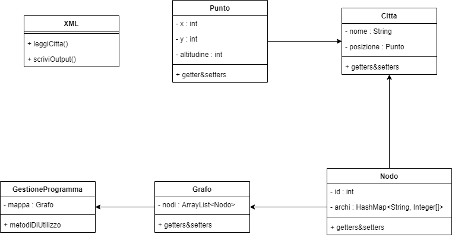

## Rovine Perdute

Esercizio Rovine Perdute progetto Arnaldo, [consegna](.github/consegna.pdf), svolto dal gruppo "gli_sprogrammatori", membri:

- Alessandro Muscio
- Tommaso Bianchin
- Gianmarco Gamo

## Documentazione

La documentazione può essere trovata [qui](http://mensipedia.altervista.org/Arnaldo/RovinePerdute/doc/index.html)

## Avvertenze
Non riuscivo a mergiare con il main, quindi il programma finito è nel branch percorso-minimo

## UML

   
    

